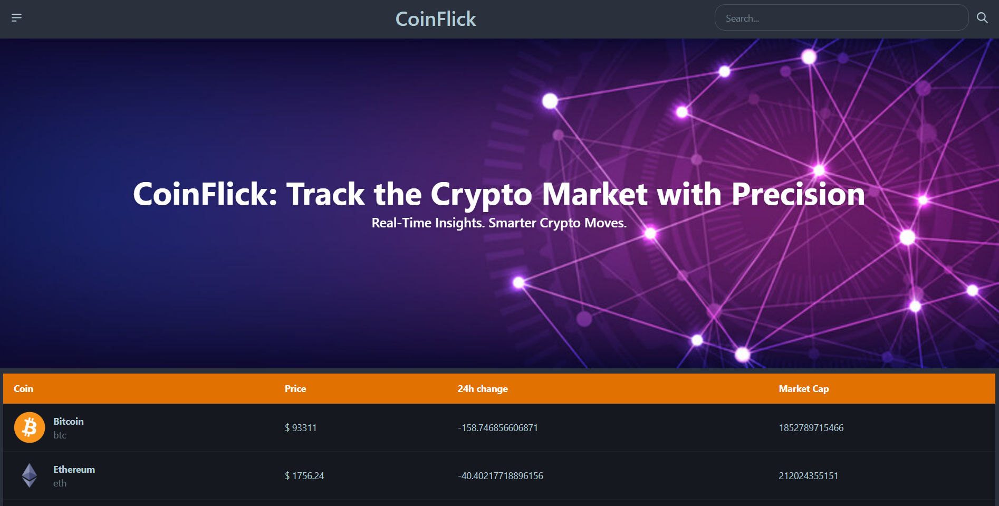
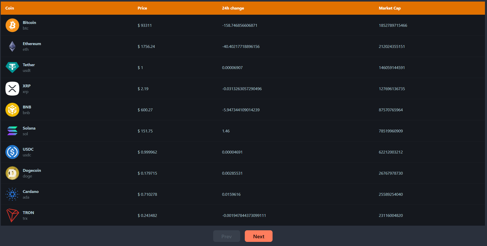
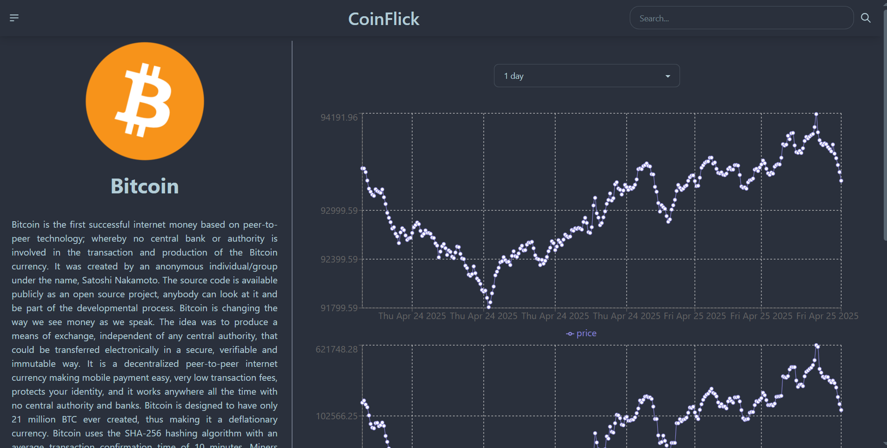

# 💸 CoinFlick

CoinFlick is a sleek and responsive crypto tracking web app that gives you real-time updates on cryptocurrency prices. Built with React and powered by the CoinGecko API, it’s the perfect tool for anyone looking to keep an eye on the crypto market.

## 🖼️ Preview


*Main dashboard showcasing real-time coin listings and market data*


*Paginated table displaying top cryptocurrencies with real-time price, 24h change, and market cap.*


*Detailed coin view with historical data chart*

## 🚀 Features

- 🔍 Search your favorite coins with instant filtering  
- 📈 View live prices, market cap, and percentage changes  
- 📊 Interactive chart view with selectable time ranges (1 day, 7 days, 30 days, etc.)  
- 🔄 Pagination for navigating through multiple coin listings seamlessly  
- 📱 Fully responsive design for mobile and desktop  
- ⚡ Lightning-fast performance with optimized API handling  

## 🛠️ Tech Stack

- **Frontend:** React, Tailwind CSS
- **API:** [CoinGecko API](https://www.coingecko.com/en/api)

## 📦 Installation

Clone the repository:

```bash
git clone https://github.com/RethikRaj/CoinFlick.git
cd CoinFlick
```

Install dependencies:

```bash
npm install
```

Start the development server:

```bash
npm run dev
```


## 🌐 Live Demo

Check out the live app here:  
👉 [coin-flick.vercel.app](https://coin-flick.vercel.app/)

---

Made with ❤️ by [Rethik Raj](https://github.com/RethikRaj)
